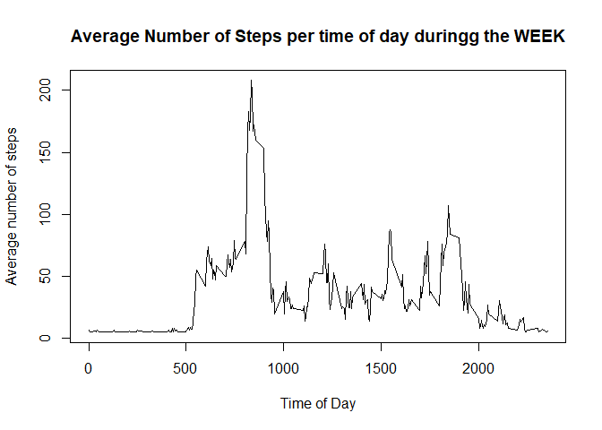

## Loading and preprocessing the data

```r
library(dplyr)
stepdata <- read.csv("./activity.csv", sep = ",", header = TRUE)
stepdata %>% mutate(stepdata, date=as.Date(date, format = ("%Y-%m-%d")))
```

## What is mean total number of steps taken per day?

```r
dailydata <- stepdata%>%
  group_by(date) %>%
  summarise(total = sum(steps, na.rm = TRUE))
hist(dailydata$total, main = "Steps per day frequency", xlab = "Steps")
```

<!-- -->


```r
meansteps <- mean(dailydata$total, na.rm = TRUE)
mediansteps <- median(dailydata$total, na.rm = TRUE)
```

The mean number of steps is 9354.2295082.  
The median number of steps is 10395

## What is the average daily activity pattern?

```r
intervalmean <- stepdata%>%
  group_by(interval) %>%
  summarise(total = mean(steps, na.rm = TRUE))
plot(intervalmean$interval, intervalmean$total, type = "l", main = "Average Number of Steps per time of day", xlab = "Time of Day", ylab = "Average Steps")
```

<!-- -->

```r
hightime <- intervalmean[which.max(intervalmean$total),]
```

The time of day with most average steps are 835

## Imputing missing values

```r
noofNA <- sum(is.na(stepdata))
```

The number of NA's is:   2304  


```r
numrows <- nrow(stepdata)
counter <- 1
imputeddata <- stepdata
meansteps <- mean(imputeddata$steps, na.rm = T)
while (counter <= numrows) {
  if (is.na(imputeddata[counter,1])){
    imputeddata[counter,1] <- meansteps
  }
  counter <- counter + 1
}


dailydataimp <- imputeddata%>%
  group_by(date) %>%
  summarise(total = sum(steps))
hist(dailydataimp$total, main = "Total Number of steps per day after imputation", xlab = "Steps per day")
```

<!-- -->

```r
meanstepsimp <- mean(dailydataimp$total)
medianstepsimp <- median(dailydataimp$total)
```

The mean number of steps after imputation is 1.0766189\times 10^{4}.  
The median number of steps after imputation is 1.0766189\times 10^{4}.  


## Are there differences in activity patterns between weekdays and weekends?

```r
imputeddata$day <- weekdays(as.Date(imputeddata$date))
weekdata <- subset(imputeddata,day == "Monday" | day == "Tuesday" | day == "Wednesday" | day == "Thursday" | day == "Friday")
weekenddata <- subset(imputeddata,day == "Saturday" | day == "Sunday")


weekintervalmean <- weekdata%>%
  group_by(interval) %>%
  summarise(total = mean(steps, na.rm = TRUE))
plot(weekintervalmean$interval, weekintervalmean$total, type = "l", main = "Average Number of Steps per time of day duringg the WEEK", xlab = "Time of Day", ylab = "Average number of steps")
```

<!-- -->

```r
weekendintervalmean <- weekenddata%>%
  group_by(interval) %>%
  summarise(total = mean(steps, na.rm = TRUE))
plot(weekendintervalmean$interval, weekendintervalmean$total, type = "l", main = "Average Number of Steps per time of day during the WEEK-END", xlab = "Time of Day", ylab = "Average number of steps")
```

<!-- -->

